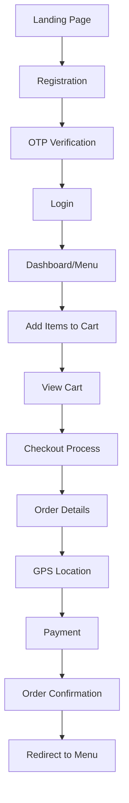
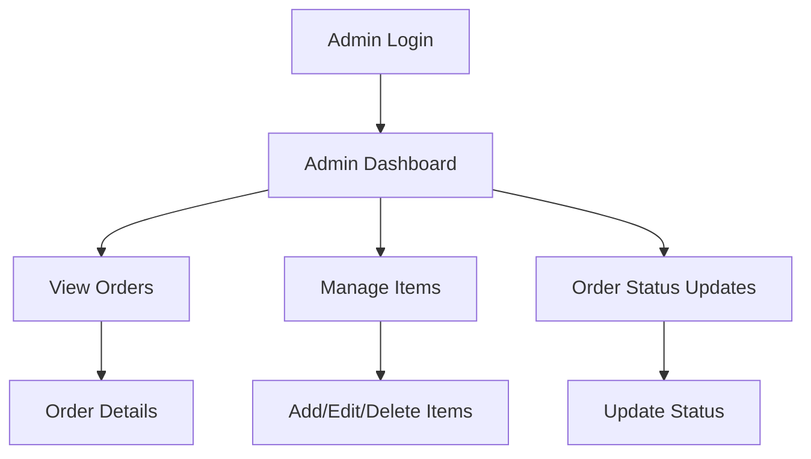

## AI/LLM Assistance

Throughout the development process LLMs was extensively used only for debugging error and generating example templates. AI was was also used to partially generate readme file which was then reviewed and further enhanced such that every aspect of readme file  provide correct information.


# Handi - MERN Stack Food Ordering System

A comprehensive full-stack food ordering application built with the MERN stack, featuring user authentication, real-time cart management, GPS-based delivery, payment processing, and admin dashboard functionality.

## Table of Contents

- [Project Overview](#project-overview)
- [Technology Stack](#technology-stack)
- [Features](#features)
- [Design Philosophy](#design-philosophy)
- [Installation & Setup](#installation--setup)
- [Application Flow](#application-flow)
- [Authentication System](#authentication-system)
- [Cart & Order Management](#cart--order-management)
- [Admin Panel](#admin-panel)
- [Database Schema](#database-schema)
- [Problems Encountered & Solutions](#problems-encountered--solutions)
- [AI/LLM Assistance](#aillm-assistance)
- [Project Structure](#project-structure)
- [Deployment](#deployment)
- [Contributing](#contributing)

## Project Overview

Handi Express is a modern food ordering application designed for a Pakistani/Indian takeaway restaurant. The application provides a seamless experience for customers to browse menu items, manage their cart, place orders with GPS-based delivery, and process payments. Administrators can manage menu items, view orders, and update order statuses through a comprehensive dashboard.

### Key Highlights:
- Full-stack MERN application with modern React patterns
- JWT-based authentication with OTP verification via SMS
- Real-time cart management with localStorage persistence
- GPS integration for accurate delivery locations
- Responsive design with square/minimalist aesthetic
- Admin dashboard for complete order and inventory management
- Payment simulation with order tracking

## Technology Stack

### Frontend Technologies
```javascript
// Core Framework
- React 18.x (Functional Components + Hooks)
- React Router DOM (Client-side routing)
- React Bootstrap 5 (UI Components)
- Vite (Build tool & development server)

// State Management
- React Context API (Global state)
- React useReducer (Complex state logic)
- localStorage (Persistent storage)

// Styling
- Bootstrap 5.3.x
- Custom CSS (Square design system)
- Responsive design principles

// HTTP Client
- Axios (API requests with interceptors)

// Development Tools
- ES6+ JavaScript
- JSX syntax
- Modern async/await patterns
```

### Backend Technologies
```javascript
// Core Framework
- Node.js (Runtime environment)
- Express.js (Web framework)
- ES6 Modules (Import/Export syntax)

// Database
- MongoDB (Document database)
- Mongoose (ODM for MongoDB)

// Authentication & Security
- JWT (JSON Web Tokens)
- bcrypt (Password hashing)
- crypto (OTP generation)
- Helmet (Security headers)
- CORS (Cross-origin requests)
- XSS-Clean (XSS protection)
- Express-mongo-sanitize (NoSQL injection prevention)

// External Services
- SMSCHEF (SMS service for OTP)
- OpenStreetMap Nominatim (Reverse geocoding)

// Development Tools
- dotenv (Environment variables)
- cookie-parser (Cookie handling)
- Express rate limiting
```

### Development & Deployment
```bash
# Package Management
- npm (Node package manager)

# Version Control
- Git (Source control)
- GitHub (Repository hosting)

# Environment
- Windows/Linux/macOS compatible
- Node.js 16+ required
```

## Features

### User Authentication
- Multi-step registration process
  - Personal information collection
  - SMS-based OTP verification
  - Secure password hashing with bcrypt + pepper
- JWT token management
  - Secure login with token generation
  - Automatic token refresh
  - Cookie and localStorage integration
- Phone number verification
  - Real SMS delivery via SMSCHEF
  - 6-digit OTP with 5-minute expiry
  - Resend OTP functionality

### Menu Management
- Dynamic item loading from MongoDB
- Real-time inventory updates
- Rich item details (name, description, price, image)
- Category-based organization
- Search and filtering capabilities

### Advanced Cart System
- Context-based state management
  - Global cart state across components
  - Real-time quantity updates
  - Automatic price calculations
- Persistent storage
  - localStorage integration
  - Cart recovery after browser refresh
  - Cross-session persistence
- Smart quantity management
  - Increment/decrement controls
  - Bulk quantity updates
  - Remove item functionality
  - Clear entire cart option

### GPS-Enabled Delivery
- Browser geolocation API integration
- Reverse geocoding using OpenStreetMap Nominatim
- Address auto-population
- Manual address override option
- Delivery vs. collection selection

### Payment Processing
- Multi-step checkout flow
  1. Order details collection
  2. GPS location detection
  3. Payment method selection
  4. Order confirmation
- Payment method options
  - Credit/Debit card simulation
  - Cash on delivery
- Order confirmation system
  - Unique order ID generation
  - Email confirmation (simulated)
  - Estimated delivery time

### Comprehensive Admin Panel
- Secure admin authentication
- Dashboard analytics
  - Total orders overview
  - Revenue tracking
  - Order status distribution
- Order management
  - Real-time order viewing
  - Status updates (new → preparing → ready → delivered)
  - Customer details access
  - Order history tracking
- Inventory management
  - Add new menu items
  - Edit existing items
  - Delete items
  - Upload item images
  - Price and description updates

## Design Philosophy

### Square/Minimalist Aesthetic
The application follows a square design system with the following principles:
- No rounded corners (`border-radius: 0 !important`)
- Clean, sharp edges for modern professional look
- Consistent spacing and typography
- Bootstrap 5 integration with custom overrides
- Responsive design for all devices

### Color Scheme
```css
Primary Colors:
- Navbar: #343a40 (Dark gray)
- Accent: #dc3545 (Red)
- Success: #28a745 (Green)
- Background: #f8f9fa (Light gray)

Text Colors:
- Primary: #333333
- Secondary: #6c757d
- White: #ffffff (for navbar)
```

## Installation & Setup

### Prerequisites
```bash
- Node.js 16+ installed
- MongoDB installed and running
- Git installed
- Modern web browser
```

### Backend Setup
```bash
# 1. Clone the repository
git clone https://github.com/zishankhan-dot/HANDI-MERN.git
cd HANDI-MERN/Backend

# 2. Install dependencies
npm install

# 3. Create environment file
cp .env.example .env

# 4. Configure environment variables
URI=mongodb://127.0.0.1:27017/HANDI
PORT=3000
SMS_API_KEY=your_twilio_api_key
SECRETKEY=your_jwt_secret_key
PEPPER=your_password_pepper
JWT_SECRET=your_admin_jwt_secret

# 5. Start the server
node server.js
```

### Frontend Setup
```bash
# 1. Navigate to frontend directory
cd ../frontend

# 2. Install dependencies
npm install

# 3. Start development server
npm run dev

# Application will be available at:
# Frontend: http://localhost:3001
# Backend: http://localhost:3000
```

## Application Flow

### User Journey


### Admin Journey


## Authentication System

### JWT Implementation
```javascript
// Token Structure
{
  "userId": "MongoDB ObjectId",
  "Email": "user@example.com",
  "PhoneNumber": "+353-xxx-xxx-xxx",
  "iat": timestamp,
  "exp": timestamp
}

// Token Storage
- localStorage: 'token' (for API requests)
- Cookies: 'authorization' (for server-side validation)
- Headers: 'Authorization: Bearer <token>'
```

### Security Features
- Password hashing with bcrypt + unique pepper
- OTP verification via SMS
- Token expiration (2 hours for users, configurable for admin)
- Secure cookie settings with httpOnly flags
- CORS protection with specific origin allowance
- Input sanitization against NoSQL injection

## Cart & Order Management

### Cart Context Structure
```javascript
const cartContext = {
  cart: {
    items: [
      {
        _id: "item_id",
        name: "Item Name",
        price: 15.99,
        quantity: 2,
        image: "image_url"
      }
    ],
    totalItems: 2,
    totalPrice: 31.98
  },
  // Actions
  addToCart: (item) => {},
  removeFromCart: (itemId) => {},
  updateQuantity: (itemId, quantity) => {},
  clearCart: () => {}
}
```

### Order Processing Flow
1. Cart Validation
   - Check item availability
   - Calculate final totals
   - Apply delivery charges (€3.50)

2. User Authentication Check
   - Verify JWT token
   - Extract user ID for order association
   - Fallback to guest orders if unauthenticated

3. Location Processing
   - Browser geolocation API call
   - Reverse geocoding via Nominatim
   - Address formatting and validation

4. Order Creation
   - Generate unique order ID
   - Store in MongoDB with user association
   - Send confirmation details

## Admin Panel

### Admin Authentication
```javascript
// Admin Credentials (Environment-based)
FIRST_ADMIN_EMAIL=ExampleAdmin@something.com
FIRST_ADMIN_PASSWORD=Admin@123

// Admin JWT Structure
{
  "adminId": "MongoDB ObjectId",
  "email": "admin@example.com",
  "role": "admin",
  "iat": timestamp,
  "exp": timestamp
}
```

### Admin Features
- Order Dashboard
  - Real-time order display
  - Status filtering (new, preparing, ready, delivered)
  - Customer information access
  - Order history and analytics

- Inventory Management
  - CRUD operations for menu items
  - Image upload functionality
  - Price and description updates
  - Category management

## Database Schema

### User Collection
```javascript
{
  _id: ObjectId,
  Name: String,
  Email: String (unique),
  PhoneNumber: String (unique),
  Password: String (hashed),
  isphoneVerified: Boolean,
  Otp: String (hashed, temporary),
  otp_expires: Date,
  createdAt: Date,
  role: String (default: "user")
}
```

### Order Collection
```javascript
{
  _id: ObjectId,
  userId: ObjectId (ref: User, optional for guest orders),
  customerName: String,
  phone: String,
  type: String (enum: ['delivery', 'collection']),
  address: String,
  items: [{
    name: String,
    qty: Number,
    price: Number
  }],
  totalPrice: Number,
  paymentMethod: String (enum: ['card', 'cash']),
  status: String (enum: ['new', 'preparing', 'ready', 'delivered', 'cancelled']),
  createdAt: Date
}
```

### Item Collection
```javascript
{
  _id: ObjectId,
  name: String,
  description: String,
  price: Number,
  category: String,
  image: String,
  available: Boolean,
  createdAt: Date,
  updatedAt: Date
}
```

## Problems Encountered & Solutions

### 1. JWT Token Inconsistency
Problem: Different JWT payload structures between user registration and login endpoints.
- Registration used `User: userId`
- Login used `userId: userId`
- Order system expected `decoded.userId`

Solution: Standardized all JWT tokens to use `userId` field consistently across all endpoints.

### 2. Environment Variable Mismatch
Problem: Backend used both `SECRETKEY` and `JWT_SECRET` in different files.
- `user.controller.js` used `process.env.SECRETKEY`
- `orderRoute.js` used `process.env.JWT_SECRET`

Solution: Unified all JWT operations to use `process.env.SECRETKEY` consistently.

### 3. Cookie vs Header Authentication
Problem: Frontend sent tokens in Authorization headers, but backend also expected cookie-based tokens.

Solution: Implemented dual token checking:
```javascript
// Check Authorization header first, fallback to cookies
let token = req.header('Authorization')?.replace('Bearer ', '');
if (!token) {
    token = req.cookies?.authorization;
}
```

### 4. Modal Centering Issues
Problem: Bootstrap modal was not perfectly centered on screen despite using `centered` prop.

Solution: Added custom CSS with flexbox centering:
```css
.modal {
  display: flex !important;
  align-items: center !important;
  justify-content: center !important;
}
```

### 5. Border-radius Override Conflicts
Problem: Bootstrap's default rounded corners conflicted with desired square design.

Solution: Created global CSS override:
```css
* {
  border-radius: 0 !important;
}
```

### 6. CORS Configuration
Problem: Frontend (port 3001) couldn't communicate with backend (port 3000).

Solution: Configured CORS with specific origin and credentials:
```javascript
app.use(cors({
    origin: 'http://localhost:3001',
    credentials: true
}));
```

### 7. Cart State Persistence
Problem: Cart data lost on page refresh.

Solution: Implemented localStorage integration with Context API:
```javascript
// Save to localStorage on every cart update
useEffect(() => {
    localStorage.setItem('cart', JSON.stringify(cart));
}, [cart]);
```

### 8. SMS OTP Integration
Problem: SMSCHEF integration required specific phone number formatting and API configuration.

Solution: Implemented proper phone number validation and SMSCHEF client setup with error handling.

### 9. GPS Location Accuracy
Problem: Browser geolocation API provided coordinates but needed human-readable addresses.

Solution: Integrated OpenStreetMap Nominatim API for reverse geocoding:
```javascript
const response = await fetch(
    `https://nominatim.openstreetmap.org/reverse?format=json&lat=${lat}&lon=${lon}`
);
```

### 10. Route Import Error
Problem: Vite development server failed due to missing `RouteTest` component import.

Solution: Removed non-existent import and cleaned up route configuration.

## AI/LLM Assistance

Throughout the development process LLMs was extensively used only for debugging error and generating example templates. AI was was also used to partially generate readme file which was then reviewed and further enhanced such that every aspect of readme file  provide correct information.


## Project Structure

```
HANDI-MERN/
├── Backend/
│   ├── data/
│   │   ├── admin.seed.js          # Admin user seeding
│   │   └── items.data.js          # Sample menu items
│   ├── middleware/
│   │   ├── auth.middleware.js     # JWT verification
│   │   ├── order.controller.js    # Order logic (deprecated)
│   │   ├── sms.js                 # SMSCHEF SMS service
│   │   └── user.controller.js     # User authentication
│   ├── models/
│   │   ├── items.model.js         # Menu item schema
│   │   ├── order.model.js         # Order schema
│   │   └── user.models.js         # User schema
│   ├── routes/
│   │   ├── adminRoute.js          # Admin API endpoints
│   │   ├── itemRoute.js           # Menu item endpoints
│   │   ├── orderRoute.js          # Order management
│   │   └── userRoute.js           # User authentication
│   ├── .env                       # Environment variables
│   ├── package.json               # Backend dependencies
│   └── server.js                  # Express server setup
├── frontend/
│   ├── public/
│   │   ├── favicon.ico
│   │   └── manifest.json
│   ├── src/
│   │   ├── api/
│   │   │   └── axios.instance.js  # API client configuration
│   │   ├── components/
│   │   │   ├── AdminDashboard.jsx # Admin main dashboard
│   │   │   ├── AdminLogin.jsx     # Admin authentication
│   │   │   ├── AdminManager.jsx   # Admin management
│   │   │   ├── ItemManager.jsx    # Menu item management
│   │   │   ├── Navigation.jsx     # Main navigation
│   │   │   ├── orderform.jsx      # Order form component
│   │   │   └── OrderManager.jsx   # Order management
│   │   ├── context/
│   │   │   └── CartContext.jsx    # Global cart state
│   │   ├── pages/
│   │   │   ├── AdminPanel.jsx     # Admin panel page
│   │   │   ├── Cart.jsx           # Cart and checkout
│   │   │   ├── dashboard.jsx      # Main menu page
│   │   │   └── register_login.jsx # User authentication
│   │   ├── App.jsx                # Main app component
│   │   ├── global-square.css      # Global styling
│   │   └── index.jsx              # React entry point
│   ├── package.json               # Frontend dependencies
│   └── vite.config.js             # Vite configuration
└── README.md                      # This file
```

## Deployment


## Contributing

1. Fork the repository
2. Create a feature branch: `git checkout -b feature/new-feature`
3. Commit changes: `git commit -am 'Add new feature'`
4. Push to branch: `git push origin feature/new-feature`
5. Submit a pull request


---

Developed on MERN Stack 
